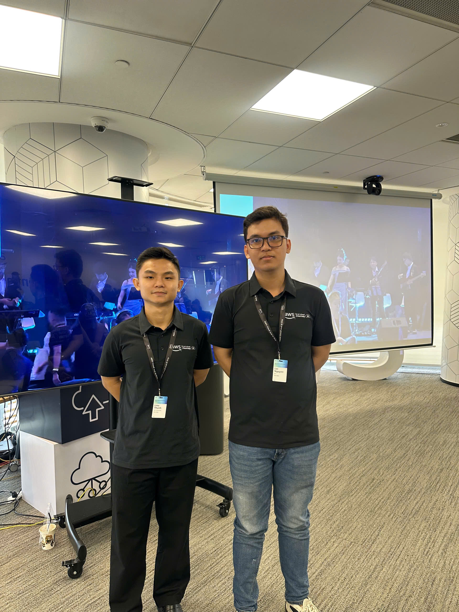

# Event Report — AWS Session on 29/09/2026

### Event Objectives

- Introduce AWS services already running inside large Vietnamese enterprises
- Share the outlook for AI in Vietnam and AWS’s role in digital transformation and system operations
- Analyze the gap between how Business Users and IT/Engineering adopt AI
- Introduce Amazon Quick (Unified AI Agent Platform) and Kiro, a next-generation engineering IDE
- Discuss how to adopt Agentic AI without losing control (Monitor – Control – Standardize)

### Speakers / Participants

- Senior AWS leaders from Southeast Asia
- AWS General Manager in Malaysia — presented on the future of AI in Vietnam and the role of AWS Vietnam in digital transformation
- Representatives from major Vietnamese enterprises, including Techcombank
- AWS / G-ASIA PACIFIC product specialists covering Amazon Quick and Kiro

### Key Highlights

#### AI and AWS in large Vietnamese enterprises

The session emphasized that AWS services are already part of production systems at large companies in Vietnam. Beyond product overviews, the AWS GM in Malaysia focused on what comes next:

- Digital transformation is not only “moving to the cloud” — it changes how systems are operated and how decisions are made
- AI is the next acceleration layer for Vietnamese enterprises if it is deployed with governance
- AWS provides both the infrastructure and the tooling to experiment quickly while protecting internal data

#### The State of AI Adoption in Enterprises

A core slide captured a familiar enterprise problem: **employees already use AI every day, but leadership does not know what they use, how they use it, or where the data goes**.

**Business Users:**

- Hard to tap internal data (CRM, customer records, etc.)
- Poor automation — still depends on manual copy-paste
- Data governance risk — sensitive data may be pasted into unauthorized tools
- No audit trail — unclear what employees are asking AI

**IT / Engineering:**

- No cost control over tokens and spend
- No control over unsanctioned external tools
- Difficult to measure ROI or justify budget
- Processes are not standardized; quality control is inconsistent

The takeaway: businesses are already getting productivity from AI, but AI usage is **not yet GOVERNED**. The operating model presented was **Monitor – Control – Standardize**.

#### Adopt Agentic AI without losing control

The speakers did not argue for banning AI. They argued for putting AI into a controlled operating model:

- **Monitor:** see who uses which tools and which data is sent out
- **Control:** permissions, guardrails, data-source limits, and cost limits
- **Standardize:** one platform, shared workflows, and consistent output quality across teams

This set up the product story: instead of many disconnected consumer tools, enterprises need a unified, governable platform.

#### Amazon Quick — Unified AI Agent Platform

Amazon Quick was introduced as a unified AI agent platform that replaces multiple disconnected tools. It is positioned as secure, measurable, and effective at using internal data, with three pillars:

- **Enterprise Intelligence:** connect On-Premises, Cloud, and SaaS sources
- **Automation:** plan and execute complex workflows
- **Security & Governance:** access control, guardrails, and audit

The key promise is that teams can use internal knowledge **without giving up security, measurement, or control**.

#### Extending Quick’s Capabilities

Quick was described as a platform that scales from **no-code to high-code**:

- **Custom Chat Agent:** an enterprise-aware assistant that is easy to share across departments
- **Quick Sight:** intelligent analytics, interactive dashboards, and self-service BI
- **Research:** in-depth analysis, consolidated reporting, and professional documents ready to export
- **Amazon Bedrock AgentCore:** custom AI agents deeply integrated into enterprise systems, with multi-agent architecture plus security and governance

#### Kiro — Next-Generation IDE for Engineering

Kiro was presented as a next-generation IDE for engineering: powerful, flexible, and cost-optimized. In role it is comparable to a traditional IDE such as Visual Studio, but with an AI-native workflow:

- Surfaces: **IDE, CLI, ACP**
- Delivery flow: **Docs → Build → Package → Deploy**
- **Diverse Models – Cost Optimized:** auto-selects a model based on task complexity
- Models mentioned on the slide included Claude Opus, GPT, DeepSeek, MiniMax, GLM, and cost-efficient coding variants

#### Vibe coding vs spec-driven development

The session explained two ways of building software with AI:

- **Vibe coding:** describe intent in natural language and let AI generate code quickly — useful for prototypes and exploration
- **Spec-driven:** start from a clear specification (requirements, constraints, architecture), then let AI implement — better for production systems, auditability, and long-term maintenance

The message: vibe coding is fast, but enterprises that need control should lean toward **spec-driven** work.

### Key Takeaways

#### Governance mindset

- AI is already inside daily work, often before IT has standardized it
- The real gap is not “AI vs no AI” — it is that **Business Users and IT/Engineering experience AI differently**
- Scaling AI requires governance: monitor, control, and standardize — not a ban

#### Platforms and tools

- Amazon Quick addresses the “one unified platform” need for business users, with governance built in
- Bedrock AgentCore is the extension path when agents must sit inside existing enterprise systems
- Kiro targets engineering teams: an IDE plus model routing that tries to balance quality and cost

#### Building software with AI

- Vibe coding and spec-driven development solve different problems
- Adopting agentic AI does not mean handing over control — humans still own guardrails, audit, and accountability

### Applying to Work / Study

- For labs and projects: write a short spec first (inputs, outputs, constraints), then generate code
- Do not paste sensitive data into external AI tools without a clear policy
- Practice “single source of truth”: pick a primary tool and keep a lightweight log of AI prompts (an audit-trail habit)
- Follow Kiro / Amazon Quick / Amazon Q in later AWS labs and compare them with a traditional IDE workflow
- Apply Monitor – Control – Standardize in team work: agree on tools and on how AI-generated code is reviewed

### Event Experience

Attending the session on **29/09/2026** made it clear that enterprise AI is no longer a future topic. Employees are already using it; leadership still lacks visibility; IT is left to worry about cost, security, and ROI.

#### Learning from leaders and real enterprises
- Hearing senior AWS leaders from Southeast Asia and the AWS GM in Malaysia discuss Vietnam’s AI trajectory
- Contributions from companies such as Techcombank showed that AWS is already running in real production systems, not only in slideware

#### Technical content that mapped to real problems
- The “State of AI Adoption” slide described shadow AI accurately: convenient for users, risky for data and spend
- Amazon Quick was framed as a way to combine chat, analytics, research, and agents on one governed platform
- Kiro showed a new IDE direction: multiple models, auto-selection by task, and a Docs – Build – Package – Deploy loop

#### Lessons learned
- Agentic AI only scales if control is not lost
- Enterprises need a unified platform more than they need more disconnected tools
- For students and early-career engineers: learn spec-driven habits early; do not rely on vibe coding alone

#### Event photos

